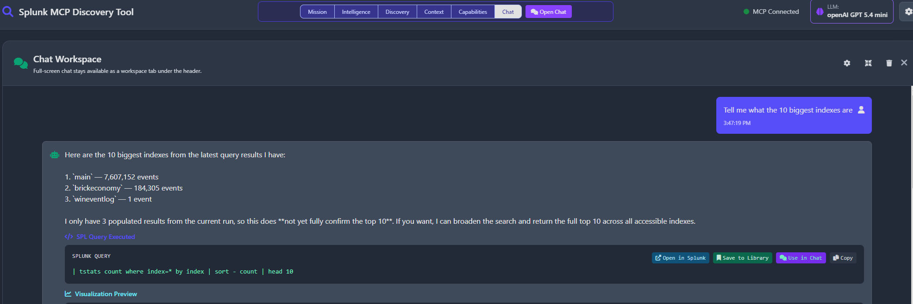
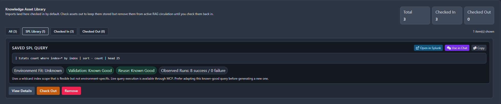
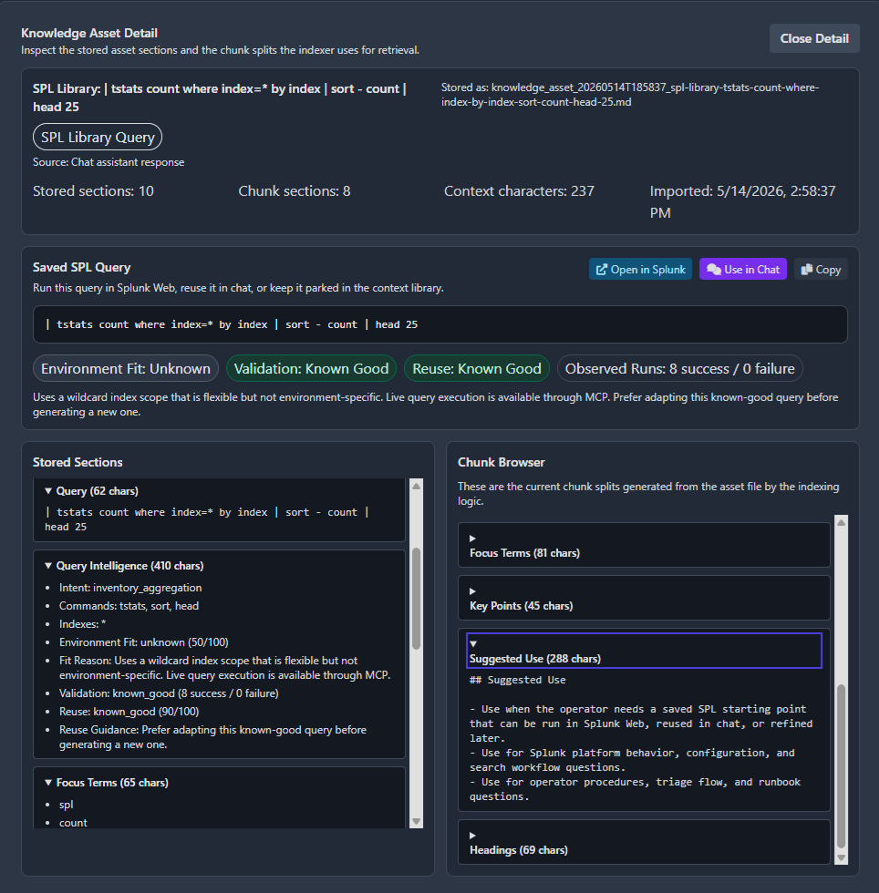
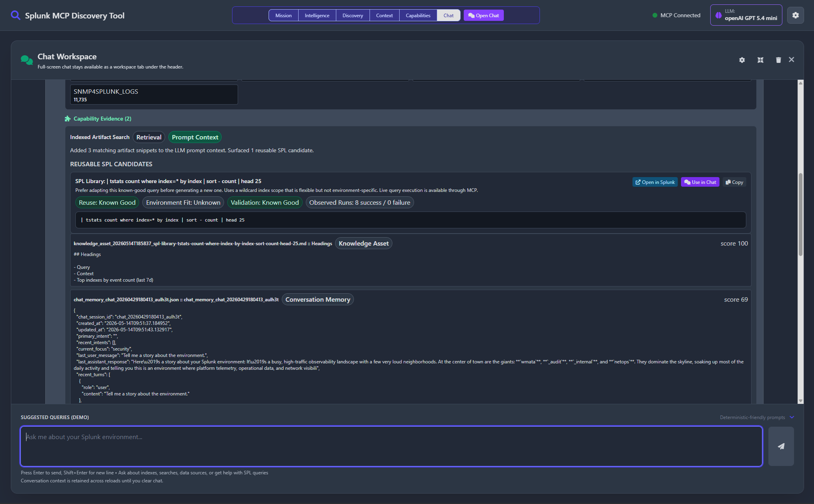

# 🔍 Splunk Discovery Tool

[](https://opensource.org/licenses/MIT)
[](https://www.python.org/downloads/)
[](https://github.com/LeiterConsulting/splunk-discovery-tool/releases)

> AI-powered Splunk environment discovery, intelligence reporting, and admin assistance with MCP integration.

## ✨ What’s Included

- V2 discovery pipeline with intelligence artifacts (`v2_intelligence_blueprint_*`, `v2_insights_brief_*`, `v2_operator_runbook_*`, `v2_developer_handoff_*`)
- Unified web workspace with static top bar and tabs for Mission, Intelligence, and Artifacts
- AI summarization endpoint (`/summarize-session`) generating contextual SPL queries and admin tasks
- Deterministic + agentic chat flows with MCP tool aliasing and robust tool-call parsing
- Encrypted credential/config storage using Fernet (no plaintext secrets)
- Universal installers for Windows (`install.ps1`) and Unix/macOS (`install.sh`)

## 📋 Prerequisites

### Required

- Python 3.8+
- pip
- PowerShell 7+ (Windows only, if using `install.ps1`)

### External Services

- Splunk MCP server endpoint + bearer token
- LLM provider key for your selected backend (OpenAI, Azure OpenAI, Anthropic, Gemini, or Custom endpoint)

## 🚀 Quick Start

### Windows

```powershell
.\install.ps1
```

### Unix/macOS

```bash
chmod +x install.sh
./install.sh
```

After startup, open the URL printed in the console (typically **http://localhost:8003**).

## ⚙️ First-Time Configuration

1. Open the app at the startup URL shown in console (default `http://localhost:8003`)
2. Click Settings (gear icon)
3. Configure:
   - MCP URL / token / SSL settings
   - LLM provider / API key / endpoint URL (if required) / model / token limits
   - Web server options (port, debug mode)
4. Save settings and restart service

### LLM Setup Notes

- Providers supported: `openai`, `azure`, `anthropic`, `gemini`, `custom`
- Endpoint URL required for: `azure`, `custom`
- Endpoint URL optional override for: `anthropic`, `gemini`
- For `custom`, you can use a base URL (for example `http://host:port/v1`); the app auto-resolves common completion paths.
- Use **Test Connection & Auto-Configure** in Settings to run:
  - connectivity probe,
  - model generation test,
  - provider-safe token recommendation.

## 🧠 Workspace Overview

- **Mission**: Run discovery, monitor live progress/log, review generated sessions
- **Intelligence**: View V2 blueprint KPIs, coverage gaps, capability graph, trends
- **Artifacts**: Browse and open V2 outputs and generated summaries

## 📸 SPL Library Workflow

The SPL Library keeps reusable SPL in the managed context workspace so operators can save good queries from chat, inspect stored context, and reuse saved SPL without leaving the tool.

### Save a Query From Chat



### Browse the SPL Library



### Inspect Stored Asset Detail



### Reuse Library Context in Chat



## 🔐 Security

- Credentials encrypted at rest (`config.encrypted`, `.config.key`)
- No plaintext secret persistence
- Configurable SSL verification and CA bundle support
- Host/CORS protections available via server settings

## 📁 Key Paths

```text
install.ps1 / install.sh       Installer + service control
src/main.py                    Runtime entrypoint
src/web_app.py                 FastAPI API + embedded React UI
src/static/                    Shipped local frontend bundle
src/discovery/v2_pipeline.py   V2 discovery pipeline + artifact packaging
src/config_manager.py          Encrypted config manager
tools/build_frontend.mjs       Rebuild shipped frontend assets from the inline source
tools/check_frontend_sync.py   Validate frontend bundle sync before release
.github/workflows/repo-validation.yml  GitHub Actions validation workflow for repo quality gates
output/                        Discovery and summary artifacts
```

## 📚 Documentation

Public-facing docs in this repository:
- `README.md` — install, configure, run
- `CHANGELOG.md` — release history and notable changes
- `CONFIGURATION_VARIABLES.md` — configuration reference
- `docs/DEVELOPER_REFERENCE.md` — developer extension/reference guide
- `docs/V2_REWRITE_GUIDE.md` — V2 architecture and migration guidance

## 🛠️ Installer Commands

| Command | Description |
|---------|-------------|
| `(no arguments)` | Install dependencies and start service |
| `--public_only` / `-PublicOnly` | Install using public PyPI only (skip private/local indexes) |
| `--start` / `-Start` | Start service |
| `--stop` / `-Stop` | Stop service |
| `--restart` / `-Restart` | Restart service |
| `--status` / `-Status` | Show status |
| `--uninstall` / `-Uninstall` | Uninstall |
| `--help` / `-Help` | Show help |

## 🐛 Troubleshooting

### Port 8003 is already in use

The app now attempts safe port reclamation/fallback automatically. If needed, restart with installer commands:

```powershell
.\install.ps1 -Restart
```

### Windows script execution blocked

```powershell
Set-ExecutionPolicy -Scope CurrentUser -ExecutionPolicy RemoteSigned
```

### MCP connection errors

- Verify URL/token in Settings
- Toggle SSL verification or set CA bundle for private cert chains

### pip install timeout / `repo.splunkdev.net` unreachable

- Some systems have a global/private pip index configured; if that index is unavailable, dependency install can time out.
- The installers now retry automatically against public PyPI (`https://pypi.org/simple`).
- To bypass private/local indexes immediately, use the installer public-only flag:

```bash
./install.sh --public_only
```

```powershell
.\install.ps1 -PublicOnly
```

- If needed, force PyPI for the current shell session before reinstall:

```bash
export PIP_INDEX_URL=https://pypi.org/simple
./install.sh
```

```powershell
$env:PIP_INDEX_URL = "https://pypi.org/simple"
.\install.ps1
```

### Frontend changes are not showing up or startup warns about stale assets

- The shipped UI is served from checked-in files under `src/static/`.
- After editing the legacy inline frontend source in `src/web_app.py`, rebuild and verify the shipped bundle:

```bash
npm run build:frontend
python tools/check_frontend_sync.py
```

- To run the deterministic browser regression for visualization previews, install the Chromium test browser once and run:

```bash
npx playwright install chromium
npm run test:browser
```

## 🤝 Contributing

Contributions are welcome via pull requests. Repo validation is also mirrored in `.github/workflows/repo-validation.yml`, which runs the documented frontend build, sync, browser regression, lint, compile, and unittest gates on GitHub-hosted runners.

## 📄 License

MIT. See [LICENSE](LICENSE).
