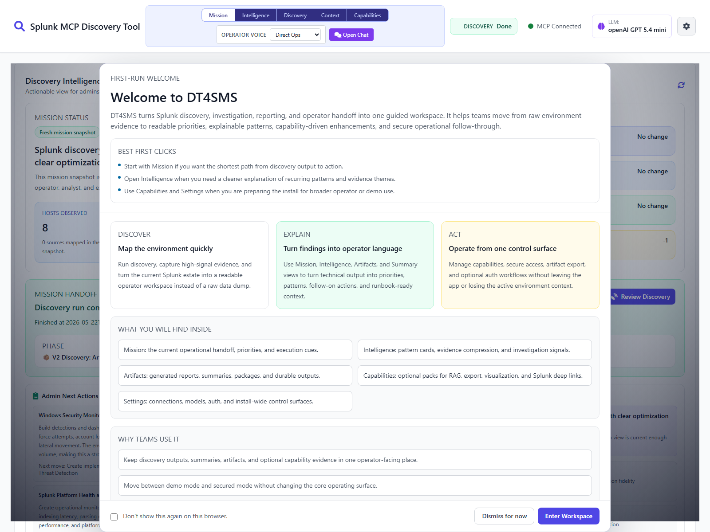
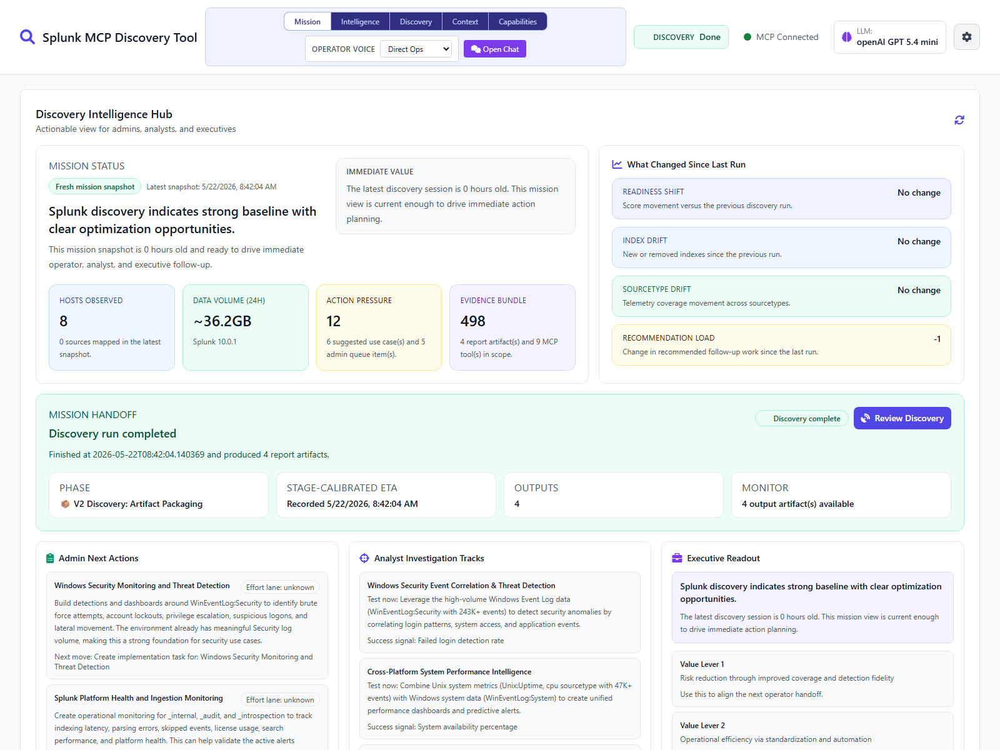
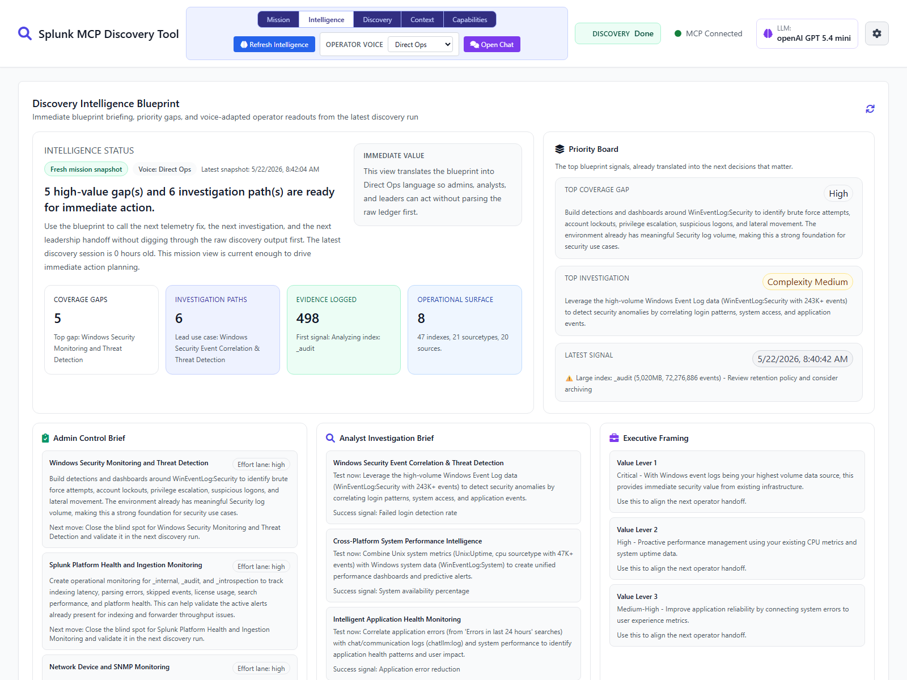

# 🔍 Splunk Discovery Tool

[](https://opensource.org/licenses/MIT)
[](https://www.python.org/downloads/)
[](https://github.com/LeiterConsulting/splunk-discovery-tool/releases)

> AI-powered Splunk environment discovery, operator workspaces, secured external access, and MCP-backed investigation.

## ✨ What’s Included

- Discovery pipeline with intelligence artifacts and stable compatibility filenames (`v2_intelligence_blueprint_*`, `v2_insights_brief_*`, `v2_operator_runbook_*`, `v2_developer_handoff_*`)
- Unified web workspace with Mission, Intelligence, Discovery, Context, Capabilities, and focused Chat/Summary surfaces
- Durable worker-backed runtime state for discovery and summarization, including persisted progress and restart-safe recovery
- AI summarization endpoint (`/summarize-session`) generating contextual SPL queries, investigation tracks, and admin tasks
- Managed SPL Library and local RAG context workspace for reusable queries and operator-facing knowledge assets
- Optional local auth, OIDC sign-in, per-user MCP assignment, and admin-managed external token issuance
- Read-only external RAG REST API and inbound MCP surface (HTTP plus stdio bridge)
- Deterministic + agentic chat flows with MCP tool aliasing and robust tool-call parsing
- Encrypted credential/config storage using Fernet (no plaintext secrets)
- Universal installers for Windows (`install.ps1`) and Unix/macOS (`install.sh`)

## 📋 Prerequisites

### Required

- Python 3.8+
- pip
- PowerShell 7+ (Windows only, if using `install.ps1`)

### External Services

- Splunk MCP server endpoint + bearer token
- LLM provider key for your selected backend (OpenAI, Azure OpenAI, Anthropic, Gemini, or Custom endpoint)

## 🚀 Quick Start

### Windows

```powershell
.\install.ps1
```

### Unix/macOS

```bash
chmod +x install.sh
./install.sh
```

After startup, open the URL printed in the console (typically **http://localhost:8003**).

## ⚙️ First-Time Configuration

1. Open the app at the startup URL shown in console (default `http://localhost:8003`)
2. Click Settings (gear icon)
3. Configure:
   - MCP URL / token / SSL settings
   - LLM provider / API key / endpoint URL (if required) / model / token limits
   - Web server options (port, debug mode)
  - Optional security/auth settings, external API exposure, and OIDC provider details
4. Save settings and restart service

### LLM Setup Notes

- Providers supported: `openai`, `azure`, `anthropic`, `gemini`, `custom`
- Endpoint URL required for: `azure`, `custom`
- Endpoint URL optional override for: `anthropic`, `gemini`
- For `custom`, you can use a base URL (for example `http://host:port/v1`); the app auto-resolves common completion paths.
- Use **Test Connection & Auto-Configure** in Settings to run:
  - connectivity probe,
  - model generation test,
  - provider-safe token recommendation.

## 🧠 Workspace Overview

- **Mission**: Current discovery handoff, snapshot deltas, admin next actions, analyst tracks, and executive framing
- **Intelligence**: Blueprint briefings, priority board, coverage gaps, and role-adapted operator readouts
- **Discovery**: Live runtime monitor, stage ledger, durable session outputs, and summary launch/resume controls
- **Context**: Managed knowledge assets, SPL Library, reusable query evidence, and operator-facing context previews
- **Capabilities**: Optional packs for RAG, exports, visualization, and Splunk deeplink workflows
- **Chat and Summary**: Full-screen investigation chat plus generated runbook/summary surfaces when operators need to go deep

## 📸 Current Workspace Snapshots

### First-run splash and workspace shell



### Mission workspace



### Intelligence workspace



## 📸 SPL Library Workflow

The SPL Library keeps reusable SPL in the managed context workspace so operators can save good queries from chat, inspect stored context, and reuse saved SPL without leaving the tool.

### Save a Query From Chat


### Browse the SPL Library


### Inspect Stored Asset Detail


### Reuse Library Context in Chat


## 🔐 Security

- Optional local username/password auth with first-login password reset flow
- OIDC sign-in with provider metadata, claim mapping, and local-user linking support
- Per-user MCP assignment plus admin-managed connection, user, and token controls
- Read-only external RAG REST API and inbound MCP access with scoped tokens and rate limiting
- Credentials encrypted at rest (`config.encrypted`, `.config.key`)
- No plaintext secret persistence
- Configurable SSL verification and CA bundle support
- Host/CORS protections available via server settings

## 📁 Key Paths

```text
install.ps1 / install.sh       Installer + service control
src/main.py                    Runtime entrypoint
src/web_app.py                 FastAPI API + frontend delivery/runtime orchestration
src/frontend_legacy_template.html Source-of-truth frontend template
src/frontend_legacy.py         Frontend template loader for runtime and build tooling
src/static/                    Shipped local frontend bundle
src/discovery/v2_pipeline.py   Discovery pipeline + artifact packaging
src/config_manager.py          Encrypted config manager
src/security_manager.py        Local auth, OIDC, sessions, roles, and token management
src/runtime_job_worker.py      Detached worker entrypoint for durable discovery/summary jobs
tools/build_frontend.mjs       Rebuild shipped frontend assets from src/frontend_legacy_template.html
tools/check_frontend_sync.py   Validate frontend bundle sync before release
tools/test_auth_browser.mjs    Browser auth/OIDC regression harness
tools/run_account_function_tests.mjs Account/auth regression entrypoint
.github/workflows/repo-validation.yml  GitHub Actions validation workflow for repo quality gates
output/                        Discovery and summary artifacts
```

## 📚 Documentation

Public-facing docs in this repository:
- `README.md` — install, configure, run
- `CHANGELOG.md` — release history and notable changes
- `CONFIGURATION_VARIABLES.md` — configuration reference
- `docs/DEVELOPER_REFERENCE.md` — developer extension/reference guide
- `docs/AUTH_TESTING.md` — local-password, OIDC, and account-function test guidance
- `docs/EXTERNAL_RAG_API_QUICKSTART.md` — read-only external RAG API setup and examples
- `docs/EXTERNAL_MCP_QUICKSTART.md` — inbound MCP setup, helper client, and stdio bridge usage
- `docs/SECURITY_ACCESS_ROADMAP.md` — shipped-state security model plus extension notes
- `docs/DISCOVERY_ARCHITECTURE_GUIDE.md` — discovery architecture and migration guidance

## ✅ Validation

From an activated virtual environment, the main local release checks are:

```bash
npm run build:frontend
python tools/check_frontend_sync.py
npm run test:browser
npm run test:auth-browser
npm run test:account-functions
python -m ruff check src tests
python -W error::SyntaxWarning -m compileall -q src tests
python -m unittest discover -v
```

## 🛠️ Installer Commands

| Command | Description |
|---------|-------------|
| `(no arguments)` | Install dependencies and start service |
| `--public_only` / `-PublicOnly` | Install using public PyPI only (skip private/local indexes) |
| `--start` / `-Start` | Start service |
| `--stop` / `-Stop` | Stop service |
| `--restart` / `-Restart` | Restart service |
| `--status` / `-Status` | Show status |
| `--uninstall` / `-Uninstall` | Uninstall |
| `--help` / `-Help` | Show help |

## 🐛 Troubleshooting

### Port 8003 is already in use

The app now attempts safe port reclamation/fallback automatically. If needed, restart with installer commands:

```powershell
.\install.ps1 -Restart
```

### Windows script execution blocked

```powershell
Set-ExecutionPolicy -Scope CurrentUser -ExecutionPolicy RemoteSigned
```

### MCP connection errors

- Verify URL/token in Settings
- Toggle SSL verification or set CA bundle for private cert chains

### pip install timeout / `repo.splunkdev.net` unreachable

- Some systems have a global/private pip index configured; if that index is unavailable, dependency install can time out.
- The installers now retry automatically against public PyPI (`https://pypi.org/simple`).
- To bypass private/local indexes immediately, use the installer public-only flag:

```bash
./install.sh --public_only
```

```powershell
.\install.ps1 -PublicOnly
```

- If needed, force PyPI for the current shell session before reinstall:

```bash
export PIP_INDEX_URL=https://pypi.org/simple
./install.sh
```

```powershell
$env:PIP_INDEX_URL = "https://pypi.org/simple"
.\install.ps1
```

### Frontend changes are not showing up or startup warns about stale assets

- The shipped UI is served from checked-in files under `src/static/`.
- After editing the frontend source template in `src/frontend_legacy_template.html`, rebuild and verify the shipped bundle:

```bash
npm run build:frontend
python tools/check_frontend_sync.py
```

- To run the deterministic browser regression for visualization previews, install the Chromium test browser once and run:

```bash
npx playwright install chromium
npm run test:browser
```

- To validate auth-enabled flows and the account-function matrix, run:

```bash
npm run test:auth-browser
npm run test:account-functions
```

## 🤝 Contributing

Contributions are welcome via pull requests. Repo validation is also mirrored in `.github/workflows/repo-validation.yml`, which runs the documented frontend build, sync, browser regression, auth/account checks, lint, compile, and unittest gates on GitHub-hosted runners.

## 📄 License

MIT. See [LICENSE](LICENSE).
