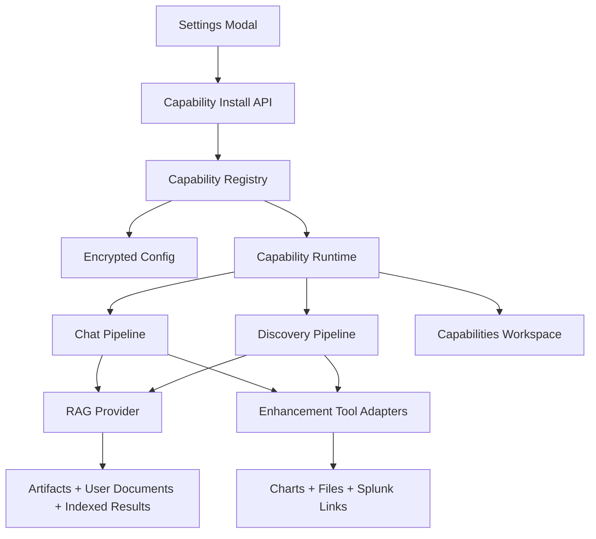

# Optional Capabilities Architecture

## Intent

This document explores an optional capabilities model for DT4SMS that adds:

- an installable RAG subsystem, potentially backed by ChromaDB
- optional enhancement tool packs for visuals, exports, and Splunk deep links
- clear UI signals that these capabilities are actively improving outcomes

The goal is not to make RAG or enhancement tooling mandatory. The default product should remain lightweight and functional with the current deterministic routes, report-aware reasoning, and MCP integration. Optional capabilities should act as force multipliers.

## Current State

The current application already has several pieces that make this feasible:

- chat augmentation is already optional via session-scoped chat settings
- a lightweight local RAG function exists today: `build_lightweight_rag_context()` in `src/web_app.py`
- encrypted persistent configuration already exists in `src/config_manager.py`
- the UI already supports multi-surface workflows using workspace tabs plus a Settings modal
- MCP configuration and LLM credential vault patterns already exist and can be reused for capability install/load/configure flows

Constraints in the current implementation:

- chat settings are session-based and reset on server restart
- the existing local RAG is only a text-snippet grab from recent output files, not a true retrieval system
- there is no installable feature registry or optional dependency management model yet
- the UI is currently a large inline React/Babel surface in `src/web_app.py`, so new capability pages should avoid uncontrolled sprawl

## Design Principles

1. Optional first

Capability packs must be off by default and absent from the runtime path unless explicitly installed and enabled.

2. Visible value

If RAG or an enhancement pack contributes to an answer, the user should see that contribution directly.

3. Safe degradation

If a capability is not installed, fails health checks, or becomes stale, the app should fall back cleanly to the current deterministic and agentic paths.

4. Capability abstraction before dependency choice

Do not bind the product architecture directly to ChromaDB, ReportLab, python-pptx, or any external MCP add-on. Introduce interfaces first, then plug in concrete backends.

5. Install from settings, operate from dedicated workspace

Settings should be used to install, enable, disable, and test optional capabilities. Ongoing configuration, content management, indexing, and health visibility should live in a dedicated workspace tab or page.

## Recommended Product Model

Introduce a new concept: `capability packs`.

Suggested initial packs:

- `rag_local`: existing lightweight output-file retrieval, formalized as a capability
- `rag_chromadb`: optional embedded vector store and richer retrieval/indexing pipeline
- `visualization_tools`: tools that transform Splunk results into charts, timeline views, and export-ready visual specs
- `export_tools`: tools that generate downloadable PDF, PPTX, and report bundles
- `splunk_deeplink_tools`: tools that generate direct Splunk Web deep links using active MCP/server context

Each capability pack should have four states:

- `not_installed`
- `installed`
- `enabled`
- `degraded`

`degraded` is important. It gives the UI a way to say "this is present but unhealthy or stale" instead of failing silently.

## Architecture Overview



## Proposed Backend Structure

Add a new package family under `src/capabilities/`.

Suggested layout:

```text
src/capabilities/
  __init__.py
  registry.py
  models.py
  install_manager.py
  health.py
  rag/
    __init__.py
    base.py
    lightweight.py
    chromadb_provider.py
    indexer.py
  tools/
    __init__.py
    base.py
    visualization.py
    export.py
    deeplink.py
```

Core responsibilities:

- `registry.py`: known capability pack definitions, dependency manifests, default config, health state
- `models.py`: dataclasses or pydantic models for installed packs, runtime config, jobs, health status
- `install_manager.py`: allowlisted package installation, uninstall, upgrade, restart-required checks
- `health.py`: background health probes and status normalization
- `rag/base.py`: retrieval interface used by chat/discovery logic
- `tools/base.py`: adapter interface for optional tools exposed to the LLM or deterministic routes

## Persistence Model

Extend the encrypted config model in `src/config_manager.py` to include persistent optional capability configuration.

Recommended additions:

```text
AppConfig
  capabilities: Dict[str, CapabilityConfig]
  active_capability_profiles: Dict[str, str]
```

Suggested `CapabilityConfig` fields:

- `name`
- `installed`
- `enabled`
- `version`
- `install_method`
- `health_status`
- `config`
- `last_tested_at`
- `last_error`
- `restart_required`

This should be persistent, unlike current chat session settings. RAG and optional pack state should survive restart.

## RAG Recommendation

### Recommendation: abstract first, Chroma second

ChromaDB is a reasonable option, but it should not be the architecture. It should be one backend behind a `RAGProvider` interface.

Why this matters:

- Chroma adds install weight and runtime complexity
- vector store health/index lifecycle needs its own operational surface
- you may want a simpler local-only or sqlite-backed mode for lower-friction demos

### Recommended RAG progression

#### Phase 1: formalize current lightweight RAG

Keep the existing snippet-retrieval concept, but move it behind the new provider interface.

Benefits:

- zero additional dependency cost
- immediate compatibility with current `output/` artifacts
- establishes the UI and observability model before vector indexing exists

#### Phase 2: optional ChromaDB local provider

Add a Chroma-backed provider with:

- local embedded persistence under `output/rag/`
- collections for discovery artifacts, runbooks, handoffs, and user-uploaded content
- optional indexing of structured discovery payloads and chat-derived knowledge items

Suggested indexed content groups:

- V2 intelligence blueprint summaries
- AI summary and insights brief content
- operator runbooks and developer handoff notes
- selected raw finding ledger entries
- optionally user-supplied reference docs

### RAG content sources

RAG should not only index free-form text files. It should have typed source categories:

- `discovery_artifact`
- `runbook`
- `handoff`
- `uploaded_document`
- `generated_summary`
- `chat_memory_derived`
- `tool_result_snapshot`

This allows better filtering and better UX when showing evidence.

## Make RAG Value Obvious

If optional RAG is enabled and contributes to a result, the user should see it.

Recommended UX signals:

- a `RAG enhanced` badge on answers that used retrieved evidence
- an expandable `Retrieved context used` section under the answer
- source cards showing file name, artifact type, timestamp, and retrieval score
- a timeline event such as `Retrieved 3 capability-boosting context chunks from indexed artifacts`
- follow-on actions annotated with why they were suggested

Example:

- `Validate Windows security live` because indexed runbook and intelligence brief both flag Windows Security Monitoring as a top-priority gap

Without this visibility, RAG becomes invisible plumbing and the user will not trust its value.

## How RAG Should Influence Chat

RAG should affect more than the prompt body.

Use it in four places:

1. Prompt context

Inject retrieved evidence into the system/user planning context, similar to the current lightweight RAG block.

2. Follow-on action generation

Allow retrieved evidence to bias follow-on suggestions toward indexed risks, gaps, recommendations, and known environment patterns.

3. Tool planning

Use RAG evidence to influence which live validation queries get tried first.

4. Post-result interpretation

Use retrieved documents to contextualize tool results, for example matching a spike to a known recommendation or known coverage gap.

## How RAG Should Influence Discovery

The discovery flow should remain grounded in actual Splunk data, but optional RAG can improve synthesis.

Recommended uses:

- retrieve prior runbooks and handoffs when generating new summaries
- compare new findings to historical discovery language for drift detection
- enrich recommendations with organization-specific documentation if uploaded
- support better executive and developer handoff outputs by referencing prior institutional context

Do not let RAG replace primary evidence from discovery results. It should enrich synthesis, not fabricate facts.

## Optional Enhancement Packs

### 1. Visualization Tools

Goal: convert Splunk results into useful charts without requiring the user to leave the app.

Recommended scope:

- line charts for time series
- bar charts for breakdowns
- tables with conditional formatting
- exportable PNG or SVG chart output
- chart specs stored as JSON artifacts

Implementation approach:

- generate chart-ready JSON server-side
- render preview in the UI using a client-side library later if desired
- expose an internal tool such as `create_visual_from_results`

Recommendation:

Treat this as an app-native tool pack first, not as an external MCP dependency. The current app can surface it through the same tool reasoning model without waiting for external MCP changes.

### 2. Export Tools

Goal: produce downloadable executive and operational outputs.

Recommended initial formats:

- PDF
- PPTX
- structured HTML bundle

Implementation approach:

- convert existing markdown/runbook/report artifacts into exportable templates
- add optional libraries only when the pack is installed

Likely libraries:

- `reportlab` or `weasyprint` for PDF
- `python-pptx` for PowerPoint

Recommendation:

Start with deterministic export generation from known artifact structures. Avoid free-form LLM-to-PDF flows at first.

### 3. Splunk Deeplink Tools

Goal: allow the app to return links that open directly into the associated Splunk instance.

Recommended functions:

- deeplink to search with SPL and time range
- deeplink to dashboards or saved searches when known
- deeplink to index-focused searches from follow-on suggestions

Implementation approach:

- derive base Splunk Web URL from MCP config or a dedicated Splunk Web setting
- URL-encode SPL and time bounds
- attach deep links to answer cards, follow-ons, and generated exports

This should be a strong force multiplier because it shortens the distance from recommendation to operator action.

## MCP Enhancements: Important Clarification

There are two ways to interpret `MCP enhancements`:

1. Additional external MCP servers or tools
2. Local DT4SMS-native tool packs surfaced through the same reasoning/tooling model

Recommendation:

Start with option 2.

Reason:

- you control lifecycle and install UX
- you avoid requiring users to stand up extra MCP infrastructure
- you can still present them as optional capabilities and later federate to true MCP servers if needed

If you want true multi-MCP support later, add a second-stage `tool provider` abstraction:

- `native`
- `primary_splunk_mcp`
- `secondary_mcp`

## Installation Model

Settings-driven installation is feasible, but it needs guardrails.

### Recommended install flow

1. Settings modal shows capability cards
2. User clicks `Install`
3. Backend runs an allowlisted dependency install using the current venv
4. Install status is written to persistent config and a capability manifest
5. UI shows one of:
   - `Ready`
   - `Restart required`
   - `Degraded`

### Guardrails

- do not allow arbitrary package names from the UI
- maintain a server-side allowlist manifest for optional dependencies
- record package version and install timestamp
- provide uninstall and health test actions

### Installer script relationship

Do not overload `install.ps1` and `install.sh` with every optional capability path. Keep them focused on base application lifecycle.

Instead:

- the app handles optional pack installs at runtime
- installer scripts continue to own base app install/start/stop/restart
- optional pack installation can request a restart, but should not require reinstall

## UI Recommendation

### Settings modal

Add a new section: `Optional Capabilities`

Each card should show:

- capability name
- what it adds
- install size or dependency note
- current state
- buttons for install, enable, disable, test, uninstall, configure

### Dedicated workspace tab

Add a new workspace tab next to Mission, Intelligence, and Artifacts:

- `Capabilities`

This is a better fit than trying to manage an operational RAG system entirely from the Settings modal.

Suggested subsections:

- `RAG`
- `Enhancements`
- `Jobs`
- `Health`

### RAG page contents

- provider selector: lightweight or ChromaDB
- source inventory and document counts
- indexing jobs and last refresh times
- search test console
- retrieval previews
- content upload/manage UI

### Enhancement page contents

- visualization pack status and sample output
- export pack status and available templates
- deeplink pack status and test link generation
- optional future MCP provider registrations

## API Surface Proposal

Add a new API family.

Suggested endpoints:

- `GET /api/capabilities`
- `POST /api/capabilities/{id}/install`
- `POST /api/capabilities/{id}/uninstall`
- `POST /api/capabilities/{id}/enable`
- `POST /api/capabilities/{id}/disable`
- `POST /api/capabilities/{id}/test`
- `GET /api/capabilities/{id}/status`
- `POST /api/capabilities/rag/reindex`
- `GET /api/capabilities/rag/sources`
- `POST /api/capabilities/rag/search`
- `POST /api/capabilities/exports/generate`
- `POST /api/capabilities/deeplinks/build`

These endpoints should mirror the operational style already used by credentials, MCP configs, and chat settings.

## Discovery Pipeline Integration Points

The current docs already define clean discovery extension points in `docs/DEVELOPER_REFERENCE.md`.

Recommended capability-aware discovery hooks:

- after V2 bundle creation, enqueue RAG indexing for eligible artifacts
- during summarization, optionally retrieve related historical context
- during runbook generation, optionally enrich with indexed prior runbooks and uploaded documents
- write a capability-usage note into the generated summary when optional packs contributed materially

## Chat Pipeline Integration Points

Recommended modifications in `chat_with_splunk_logic()`:

- ask registry whether RAG is installed and enabled
- request a capability-aware context bundle rather than directly calling only `build_lightweight_rag_context()`
- pass capability evidence into follow-on action generation
- include a `capability_usage` block in the response payload for the UI

Suggested response payload addition:

```json
{
  "capability_usage": {
    "rag": {
      "enabled": true,
      "provider": "chromadb",
      "sources_used": 3
    },
    "enhancement_tools": ["splunk_deeplink_tools"]
  }
}
```

## Implementation Phases

### Phase 1: capability framework

- add capability config model and registry
- add install/test/enable/disable endpoints
- move current lightweight RAG behind a provider interface
- add Settings modal capability cards
- add Capabilities workspace tab shell

### Phase 2: visible RAG value

- add evidence display in chat answers
- add retrieval-aware follow-on action generation
- add indexing of current V2 artifacts into a normalized source catalog

### Phase 3: ChromaDB provider

- add optional Chroma install flow
- add local collection/index lifecycle management
- add uploadable user document support

### Phase 4: enhancement packs

- add visualization tools
- add export tools
- add Splunk deeplink tools

### Phase 5: capability-aware discovery synthesis

- use indexed prior artifacts and user docs during summary/runbook generation
- surface capability contribution in generated outputs

## Strong Recommendation

The right first move is not "install ChromaDB".

The right first move is:

1. formalize capabilities as optional packs
2. persist capability state in encrypted config
3. create a dedicated Capabilities workspace tab
4. turn current lightweight RAG into a provider behind the new interface
5. make capability contribution visible in chat and discovery outputs

Once that foundation exists, adding ChromaDB is straightforward and low-risk.

Without that foundation, Chroma would add complexity before the product has a clean way to install, configure, observe, or prove the value of optional capabilities.

## Suggested First Implementation Slice

If implementing this incrementally, the best first slice is:

- add capability registry and persistent config model
- add `Capabilities` workspace tab
- move current local RAG into `rag_lightweight` capability
- show `RAG enhanced` evidence in chat when used
- add a single optional enhancement pack: `splunk_deeplink_tools`

That slice is valuable because it proves:

- optional install/config UX
- persistent feature state
- visible force multiplier behavior
- a clean path to richer packs later
